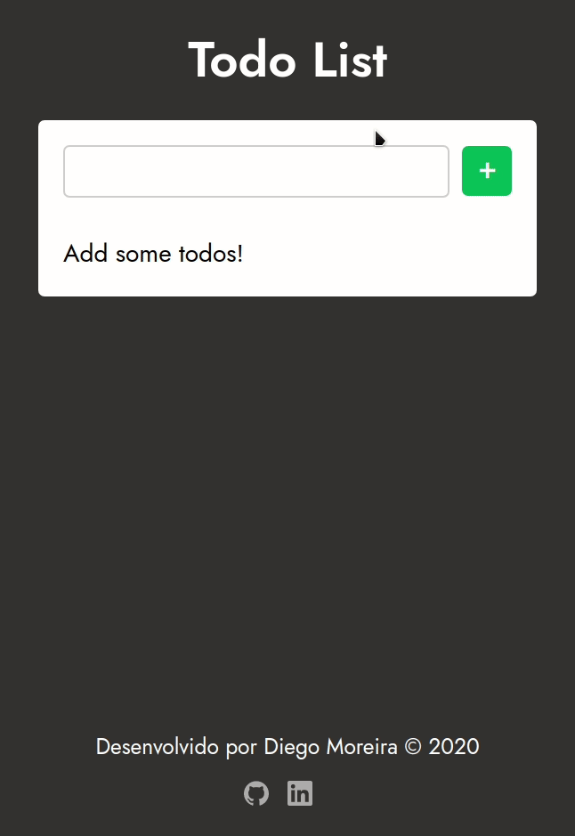

# Client Todo List

Implementação de uma aplicação de Todo List sem integração com servidor, com persistência de dados no localstorage.
O principal objetivo com este projeto é treinar e demonstrar os conhecimentos com as linguagens utilizadas.

[Acesse Aqui](https://diegyohoho.github.io/client-todo-list/)

## Linguagens

  - Javascript
  - HTML
  - CSS

## Licença

Esse projeto está sob a licença MIT. Veja o arquivo [LICENSE](/LICENSE) para mais detalhes.

---

  
Desenvolvido por 🤘 Diego Moreira

   
  
  

